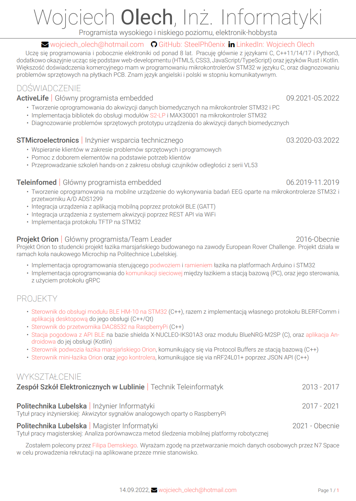

# CV

[Click here for PDF version (PL)](./my_resume_pl.pdf)

## License

Copyright 2021 Avinal Kumar
This work may be distributed and/or modified under the conditions of the [LaTeX Project Public License](https://www.latex-project.org/lppl/lppl-1-3c/), either version 1.3 of this license any later version.

## Acknowledgements

This resume template is inspired by [Alessandro Rossini's Adaptive CV](https://www.overleaf.com/latex/templates/adaptive-cv/vfngmmqpmmsb) , [Debarghya Das's Deedy CV](https://www.latextemplates.com/template/deedy-resume-cv) and [Font Awesome](https://fontawesome.com/) icons.
